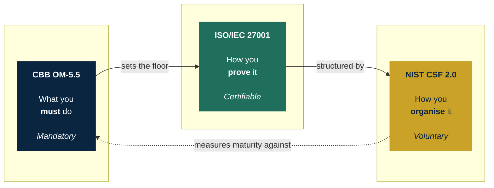
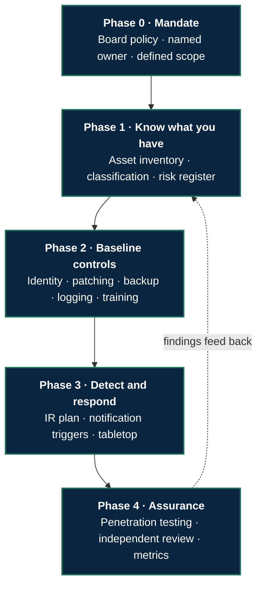

# Bahrain GRC Framework

**CBB OM-5.5 &nbsp;→&nbsp; ISO/IEC 27001:2022 &nbsp;→&nbsp; NIST CSF 2.0**

A control-level crosswalk for Bahraini financial institutions, 
and a prioritised plan for the ones starting from zero.

 

[العربية](README.ar.md) &nbsp;·&nbsp; [Mapping register](mappings/) &nbsp;·&nbsp; [Implementation plan](implementation-plan/) &nbsp;·&nbsp; [Methodology](docs/methodology.md)

---

## The problem in one paragraph

A Bahraini licensee opens the CBB Rulebook and finds obligations. It opens ISO/IEC 27001 and finds a management system. It opens NIST CSF and finds a taxonomy. Nobody tells it how the three relate, which one to start with, or what to build first when the answer to "what controls do you have?" is *none*. This repository answers those three questions.

## How the three fit together

> The Rulebook tells Bahraini banks what they must do. ISO 27001 is how they prove they do it systematically. NIST CSF is the map they use to organise and measure it.

## What is actually in here

| | Directory | What it gives you |
|---|---|---|
| ■ | [`mappings/`](mappings/) | Control-by-control crosswalk as CSV — diffable, sortable, importable into any GRC tool |
| ■ | [`implementation-plan/`](implementation-plan/) | Five phases, each with an exit criterion, ordered by risk reduced per unit of effort |
| ■ | [`mappings/rationale/`](mappings/rationale/) | Per-domain expansion of the two composite Rules — OM-5.5.15's eleven policy domains and OM-5.5.18's preventive stack, with mappings considered and rejected |
| ■ | [`mappings/appendix-c-decomposition.md`](mappings/appendix-c-decomposition.md) | Appendix C indexed to CSF 2.0 — including the fact that CBB's Appendix is built on CSF **1.1** |
| ■ | [`docs/`](docs/) | Mapping methodology, [sources and conventions](docs/sources-and-conventions.md), and a candid limitations section |
| ■ | [`examples/`](examples/worked-assessment-incident-reporting.md) | One section assessed end to end against a fictional licensee — findings, remediation order, residual risk |

## The build order

Most organisations under regulatory pressure start with penetration testing, because testing is the visible obligation. Commissioning a test against an estate with no asset inventory and no patching process produces a long report and zero improvement. This is the order that avoids that.

<b>Why this order and not another</b>

 

Each phase produces the artefacts the next one consumes.

- **Phase 0 before everything.** Without a named accountable owner, every later phase stalls at the first budget conversation.
- **Phase 1 before Phase 2.** You cannot select controls for an estate you have not enumerated. Control selection without an asset inventory is guesswork with a policy document attached.
- **Phase 2 before Phase 3.** An incident response plan for an environment with no logging has nothing to respond *with*.
- **Phase 4 last.** Assurance tests controls. Controls have to exist first.

The dotted line matters more than the solid ones. A programme where Phase 4 findings never reach the Phase 1 risk register is not a management system — it is an annual expense.

## Scope

<table>
<tr>
<td valign="top" width="50%">

**In scope**

- CBB Rulebook Volume 1, Module OM-5.5
- Crosswalk to ISO/IEC 27001:2022 clauses and Annex A
- Crosswalk to NIST CSF 2.0 categories
- Prioritised sequence for a zero-baseline organisation
- Evidence artefacts expected per control

</td>
<td valign="top" width="50%">

**Out of scope**

- Volumes 2–6 of the Rulebook
- Outsourcing (OM-2), except where it intersects OM-5.5
- Sector guidance outside CBB-licensed entities
- Tooling recommendations and vendor selection

</td>
</tr>
</table>

## Sourcing discipline

This is the part that decides whether the repository is worth anything.

- **No control text is written from memory or generated.** Every requirement is transcribed from the current official Rulebook and cited by paragraph reference.
- **The Rulebook version and consultation date are recorded** in [`docs/methodology.md`](docs/methodology.md). Regulations are amended; an undated crosswalk is worthless.
- **ISO/IEC 27001 control text is never reproduced.** Annex A controls are referenced by identifier only — `A.8.8`, not the wording. The standard is copyright ISO; using this mapping requires your own licensed copy.
- **Weak mappings are marked weak.** `partial` and `none` are legitimate results. A crosswalk with no gaps is a crosswalk nobody checked.

## Status

**Crosswalk populated.** All 62 paragraphs of OM-5.5 (OM-5.5.1–61 plus 21A) are mapped to ISO/IEC 27001:2022 clauses and Annex A controls and to NIST CSF 2.0 categories, in English and Arabic. Both composite Rules are decomposed, Appendix C is indexed, and the implementation plan is written.

**Under review.** Paragraph references and requirement summaries are transcribed from the current official Rulebook. The ISO and CSF assignments are the author's analysis, produced with AI assistance, and are being verified row by row. Treat individual mappings as drafts until that pass is complete.

Next: per-paragraph evidence artefacts, and a Volume 2 (Islamic banks) delta.

## Related work

**`cbb-rulebook-gap-assessment`** — earlier gap assessment against OM-5.5 using a fictional entity, covering cyber security risk management and outsourcing.

---

Independent project by a cybersecurity student at the University of Bahrain. 
Not affiliated with or endorsed by the Central Bank of Bahrain. 
Not regulatory, legal, or compliance advice — always work from the current official Rulebook.

 

MIT licensed · <a href="LICENSE">LICENSE</a>

